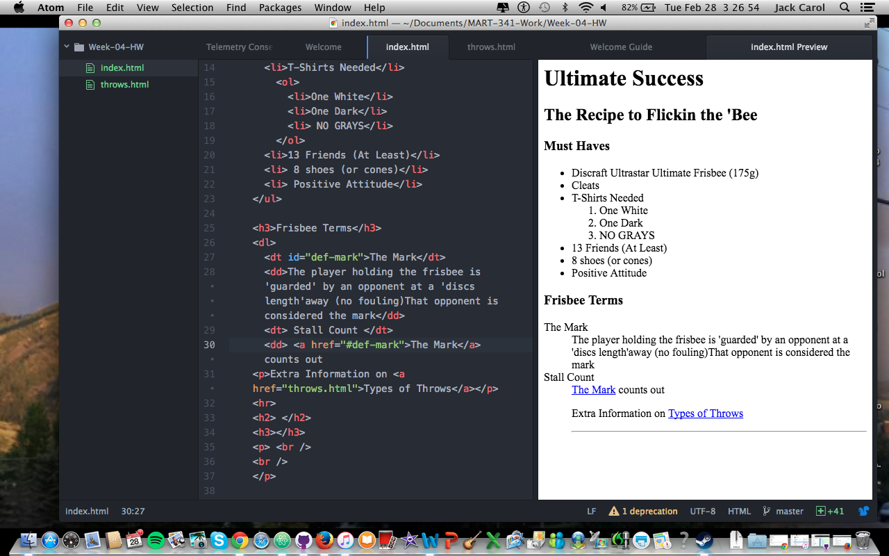

## This is a Markdown File of HW 4

I made a Ultimate Frisbee website (apparently it's great)I was guided by Justine's Website which involved ingredients and instructions to create a Chocolate BEET cake.

i partly did this by viewing Page Source information and looking at tags and elements within the webpage

Although i've only skimmed the surface of the WayBack machine it is definitely a useful tool for web developers, seeing how quickly the internet is evolving and could also be useful to your own evolution as a web developer 
